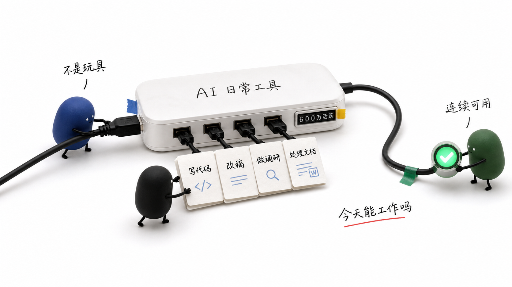
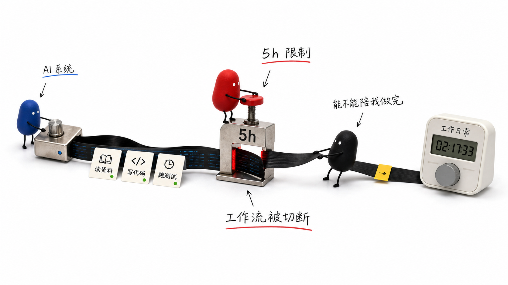
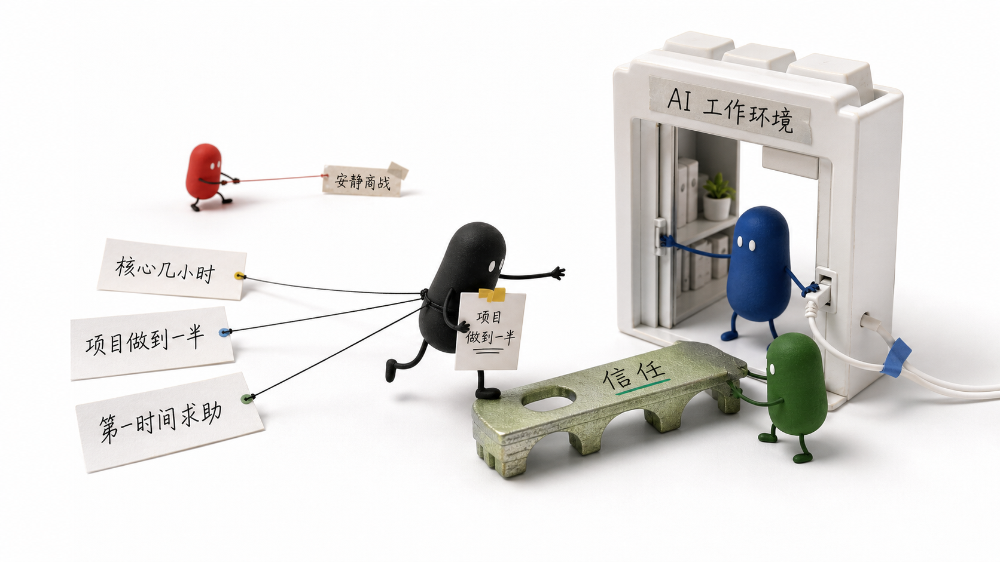
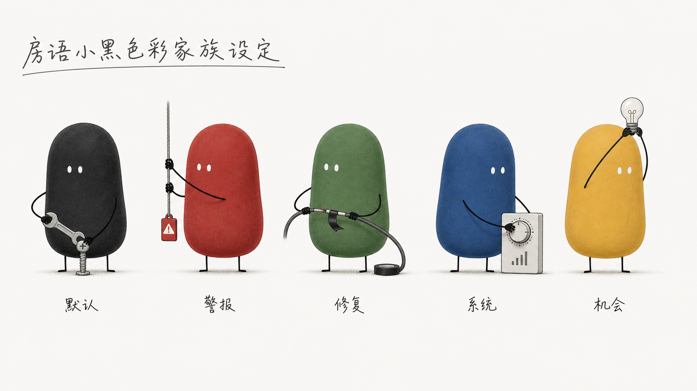

# fangyu-xiaohei-colors

房语彩色小黑角色协同系统。

这个 Skill 用来固定“胶囊款 Xiaohei”的彩色角色体系：同一个竖向胶囊小黑，只通过低饱和身体颜色产生不同角色分工，并在真实物件场景里协同工作。

## 核心设定

彩色小黑不是把小黑简单涂成不同颜色，也不是一组新的吉祥物。

它是一套角色协同系统：

- 小黑：主叙事、用户、默认行动者
- 小红：警报、冲突、商战压力
- 小绿：修复、稳定、信任
- 小蓝：系统、工具、代码、数据
- 小黄：机会、提醒、启动、点亮
- 小灰：疲惫、等待、过渡
- 小白：空状态、待确认、留白

所有角色必须保持同一个胶囊款 Xiaohei 形体：竖向胶囊身体、一体化圆角轮廓、白色小椭圆眼、极细四肢、无衣服无帽子。颜色只改变身体主色。

## 适用场景

- 中文文章配图
- 小黑 2.0 真实物件场景图
- 公众号正文图
- 长卷故事图
- AI 工具、产品竞争、工作流、活动流程、风险修复等主题的视觉隐喻
- 多个彩色小黑在同一个真实物件任务中分工协同

## 图片锚点

这些图片是本 Skill 的视觉质量锚点。使用时不要机械复刻构图，而是对齐它们的角色形体、色彩分工、真实物件质感和协同动作关系。

### 胶囊款协同参考


核心锚点：这是当前最重要的形体参考。所有彩色小黑都应保持竖向胶囊身体、一体化圆角轮廓、白色小椭圆眼、极细四肢、无头身分离。画面重点是多个胶囊款角色围绕同一个真实物件任务协同工作。

### 五色 AI 工作台


核心锚点：适合 AI 工具、系统接入、项目推进类场景。小黑推进任务，小蓝负责系统接入，小红处理风险提醒，小绿稳定连接，小黄点亮机会。

### 五色活动流程


核心锚点：适合活动、会务、流程落地类场景。小黄负责预热启动，小黑负责执行入场，小蓝负责系统支持，小红负责提醒风险，小绿负责连接关系。

### 五色风险修复


核心锚点：适合故障、风险、修复、恢复连续性的场景。小红指出风险，小蓝做系统诊断，小绿执行修复，小黑拉住主线继续推进，小黄照亮下一步。

### 日常工具协同



核心锚点：适合“AI 从尝鲜进入日常工具”的文章。小蓝代表系统，小黑代表真实用户任务，小绿代表稳定、连续可用和信任。

### 时间限制协同



核心锚点：适合额度、限流、用户时间竞争、连续工作被切断的场景。小蓝代表系统，小红代表限制和压力，小黑代表用户拉住工作流。

### 信任入口协同



核心锚点：适合结尾升维、平台信任、AI 变成工作环境的场景。小黑代表用户，小蓝代表 AI 工作环境，小绿代表信任桥，小红只作为远处的安静竞争压力。

### 彩色家族设定板



核心锚点：这是早期角色色彩方向参考，只用于理解颜色角色，不作为当前最终形体的唯一参考。正式出图以“胶囊款协同参考”和五色协同图为准。

## 目录结构

```text
fangyu-xiaohei-colors/
├── SKILL.md
├── agents/
│   └── openai.yaml
├── references/
│   ├── character-lock.md
│   ├── role-system.md
│   ├── prompt-blocks.md
│   └── qa-checklist.md
└── assets/
    └── examples/
```

## 使用方式

在 Codex 中安装或引用该 Skill 后，可以这样调用：

```text
Use $fangyu-xiaohei-colors to 根据这段中文内容判断应该使用哪些彩色小黑角色，并设计它们的分工、协同动作和生图提示词。
```

如果直接生成图片，建议同时结合 Xiaohei Scenes 2.0 的真实物件风格：先判断内容场景，再选择颜色角色，最后让每个角色在同一个真实物件任务中发生物理动作。

## 质量原则

- 颜色必须表达叙事功能，不做装饰。
- 每个彩色小黑都必须承担具体动作。
- 多个角色必须协同完成同一个真实物件任务。
- 不做排排站，不做角色海报，不做彩虹吉祥物。
- 形体必须保持胶囊款 Xiaohei，不要大圆头、分离头身或塑料玩具风。
