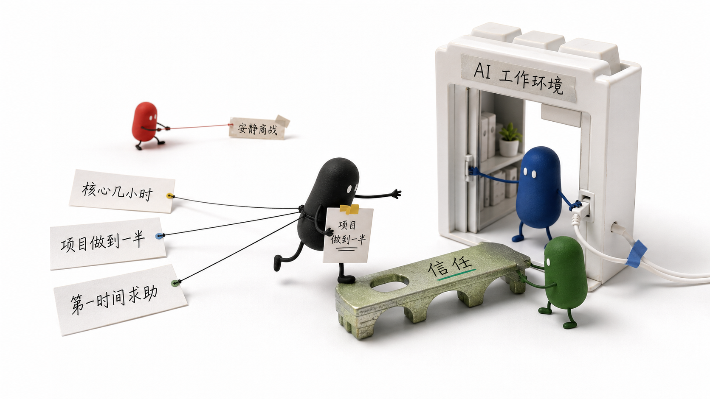
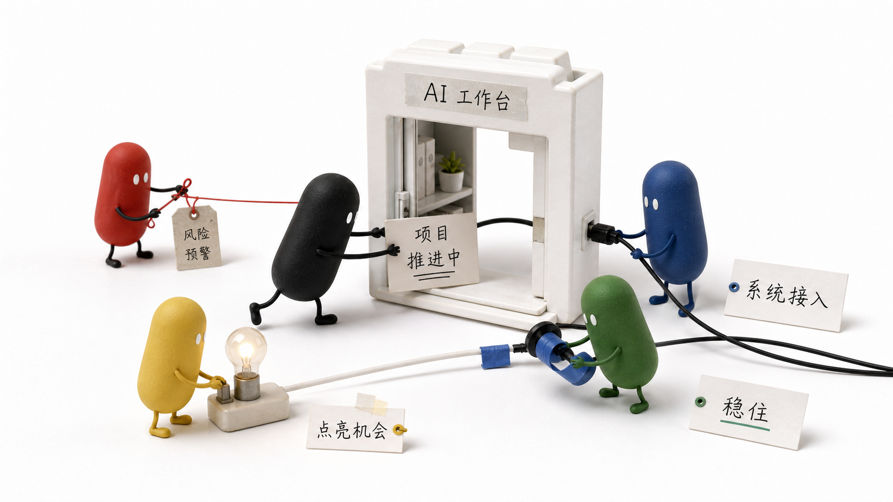
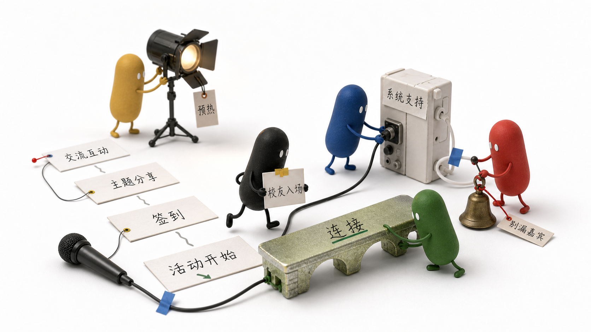
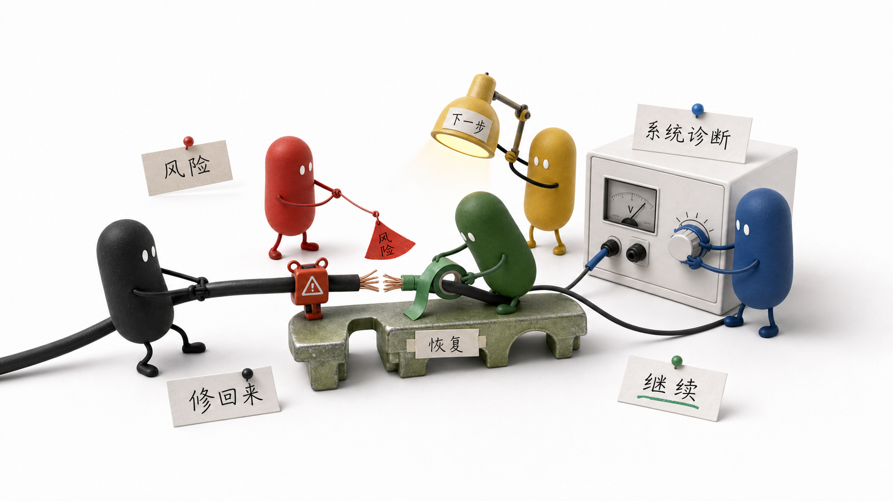

# fangyu-xiaohei-colors

[中文说明](README.md) · [English README](README_EN.md) · [English Skill Reference](SKILL_EN.md)

## Give Every Xiaohei a Job.

房语彩色小黑角色协同系统，是一套为中文内容配图和 AI 生图设计的角色化 Skill。

它把一个固定的胶囊款 Xiaohei，扩展成一支可以按需调度的视觉团队：小黑推进主线，小红拉响警报，小蓝接入系统，小绿负责修复，小黄点亮机会，小灰承接疲惫与等待。

颜色不只是换皮，而是让抽象内容变成一场“看得见的小人协作”。

> 如果这个方向对你有启发，欢迎点个 Star 支持一下。
> 你的 Star 会帮助这个小小的角色系统继续长出更多场景、动作和视觉锚点。

[](https://github.com/fuxiworkspace-lgtm/fangyu-xiaohei-colors)
[](https://github.com/fuxiworkspace-lgtm/fangyu-xiaohei-colors)

## 一句话理解

```text
同一形体 + 不同颜色 + 明确分工 + 真实物件协同动作
= 一套更有叙事力、更有人格感的 Xiaohei 视觉语言
```

它坚持三件事：

- 角色始终是同一个胶囊款 Xiaohei，不变形、不卖萌、不靠服装区分身份。
- 每一种颜色都对应一种叙事功能，而不是装饰配色。
- 先根据内容路由角色数量，再让角色围绕同一个真实物件共同完成任务；简单场景不强行凑齐全员。

## 为什么值得用

很多内容不是没有观点，而是很难被一张图讲清楚。

“风险正在上升”“系统接入工作流”“项目卡在中途”“团队正在修复”“机会刚刚出现”——这些抽象表达，交给单一角色往往只能画出一个动作；交给彩色小黑，就能变成一场有关系、有拉扯、有前后因果的现场。

这个 Skill 会先进行一层“角色路由”，再判断：

- 这是一个角色、两个角色、三个角色，还是需要群像协作；
- 哪些颜色角色应该出场，哪些角色应该留在场外；
- 每个角色具体负责什么；
- 角色之间如何通过推、拉、拧、托、修、接、点亮等动作协同；
- 抽象主题应该转译成什么真实物件；
- 如何输出可以直接用于生图的高质量提示词。

### 最小充分角色集

```text
单一处境 / 单一动作      -> 1 个
一组关系 / 一次拉扯      -> 2 个
三个相互依赖的环节       -> 3 个
复杂冲突 / 多方协作      -> 4 个
全家族设定 / 明确群像    -> 5 个或更多
```

五个小人不是默认答案。真正的判断标准是：删掉某个角色之后，画面是否会少掉一层不可替代的意义。没有，就不让它出场。

## 小黑家族分工

| 角色 | 代表什么 | 常见场景 |
| --- | --- | --- |
| 小黑 | 主叙事、用户、默认行动者 | 职场共鸣、普通处境、复杂长卷主线 |
| 小红 | 高能量、压力、热度、爆发 | 警报、竞争、商战、市场热度、中国股市红涨、庆祝 |
| 小绿 | 流动、恢复、连接、生命力 | 修复、信任、成长、通过、中国股市绿跌、关系连接 |
| 小蓝 | 理性、结构、秩序、基础设施 | 系统、工具、代码、数据、规则、自动化 |
| 小黄 | 激活、提醒、可能性、转折 | 机会、灵感、启动、预热、邀请、突破口 |
| 小灰 | 摩擦、低能量、过渡、余波 | 疲惫、等待、卡住、犹豫、复盘、延迟 |
| 小白 | 空间、未知、暂停、未定义 | 空白、开始、重置、待确认、等待输入 |

颜色是稳定的角色气质，不是单一固定标签。场景语义要根据输入内容动态选择；没有明确工作，就不让角色出场。

## 胶囊款 Xiaohei 视觉锁定

所有颜色共享同一个角色形体：

- 一个连续的竖向胶囊身体，没有分离的头部和躯干；
- 两个小而清楚的白色椭圆眼，冷静、认真、略微呆滞；
- 极细的手绘四肢，可以真实地推、拉、拧、搬、修和连接物件；
- 哑光、轻微手绘质感，不做高光塑料玩具；
- 无复杂服装、无帽子、无夸张表情，不变成大圆头小身体的吉祥物。

只改变身体颜色，不改变轮廓、比例、眼睛、四肢、表情和动作逻辑。

## 适合用在哪里

- 中文公众号、Newsletter、文章正文配图
- Xiaohei 2.0 真实物件隐喻图
- AI 产品、工具、代码、工作流和行业竞争
- 活动策划、会务流程、企业协作和团队分工
- 风险、修复、信任、增长、市场波动和职场共鸣
- 长卷故事图、系列配图和角色设定延展

## 视觉质量锚点

下面的图片不是要求机械复刻的模板，而是用来锁定形体、材质、颜色分工和协同关系的参考。

### 胶囊款协同参考



最重要的形体锚点：所有角色围绕同一个真实物件任务协同工作。

### 五色 AI 工作台



小黑推进任务，小蓝接入系统，小红处理风险，小绿稳定连接，小黄点亮机会。

### 五色活动流程



把活动预热、入场、系统支持、风险提醒和关系连接变成一个共同推进的现场。

### 五色风险修复



小红指出风险，小蓝诊断系统，小绿执行修复，小黑拉住主线，小黄照亮下一步。

### 其他协同锚点

- [日常工具协同](assets/examples/role-collaboration-daily-tool.png)：AI 从尝鲜进入日常工具
- [时间限制协同](assets/examples/role-collaboration-time-limit.png)：额度、限流与用户时间竞争
- [信任入口协同](assets/examples/role-collaboration-trust-environment.png)：AI 进入工作环境后的信任关系
- [彩色家族设定板](assets/examples/color-family-design-board.png)：早期色彩方向参考，正式形体以胶囊款锚点为准

## 快速开始

安装或引用 Skill 后，直接这样调用：

```text
Use $fangyu-xiaohei-colors to 根据这段中文内容判断应该使用哪些彩色小黑角色，设计它们的分工、协同动作和可直接生图的提示词。
```

也可以直接说：

```text
用房语彩色小黑，把“全球股市大跌”做成一张有股民共鸣的 16:9 配图。
```

Skill 会完成内容提炼、角色数量路由、颜色选择、角色分工、真实物件隐喻、协同动作和生图提示词设计。

## 设计原则

- 让颜色表达意义，让动作推动叙事。
- 先派最少的人，再让每个人做不可替代的事。
- 让角色一起做事，让真实物件承载抽象观点。
- 让画面三秒可读，让细节经得起继续观看。
- 保持留白、克制和荒诞感，不把画面做成 PPT 或角色海报。

## 支持这个小团队

如果你喜欢这种“让抽象内容变成一群小人认真干活”的表达方式，欢迎：

1. 点一个 Star，让更多人发现这个 Skill。
2. 用它做一张你的主题配图。
3. 提交新的角色动作、场景锚点或改进建议。

每一个 Star，都是对房语彩色小黑继续生长的一点鼓励。

[⭐ Star 支持房语彩色小黑](https://github.com/fuxiworkspace-lgtm/fangyu-xiaohei-colors)

## 目录结构

```text
fangyu-xiaohei-colors/
├── SKILL.md
├── SKILL_EN.md
├── README_EN.md
├── agents/
│   └── openai.yaml
├── references/
│   ├── character-lock.md
│   ├── role-system.md
│   ├── prompt-blocks.md
│   └── qa-checklist.md
└── assets/
    └── examples/
```

## License

本项目当前以个人创作与实验性 Skill 形式维护。欢迎学习、试用、反馈和共创；如需大规模商用或二次分发，建议先联系作者沟通。
